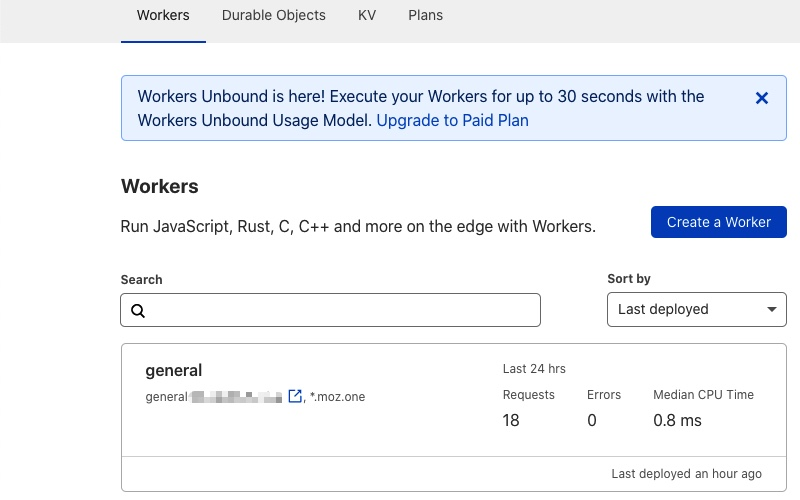
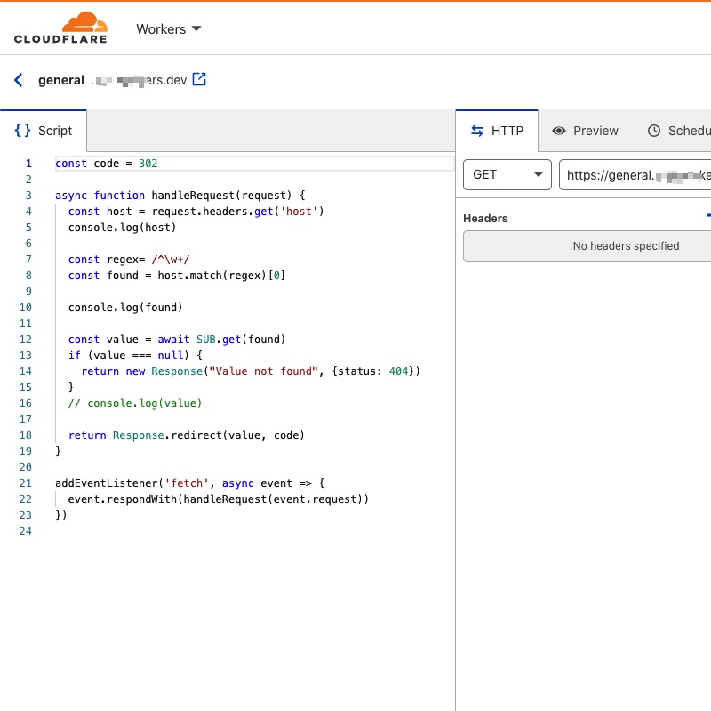
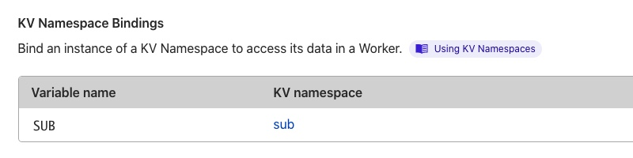
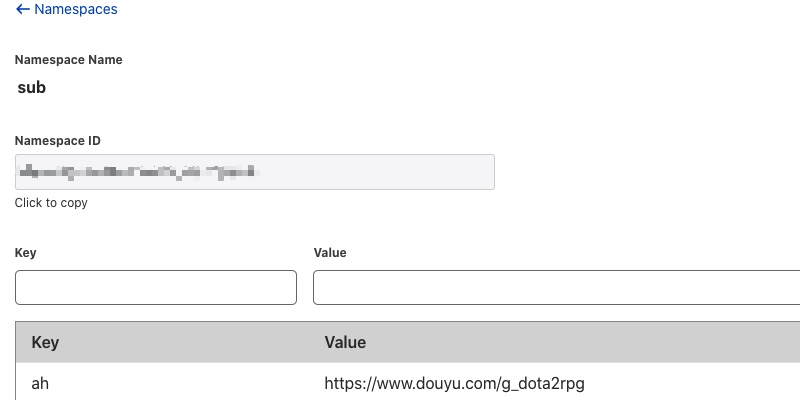
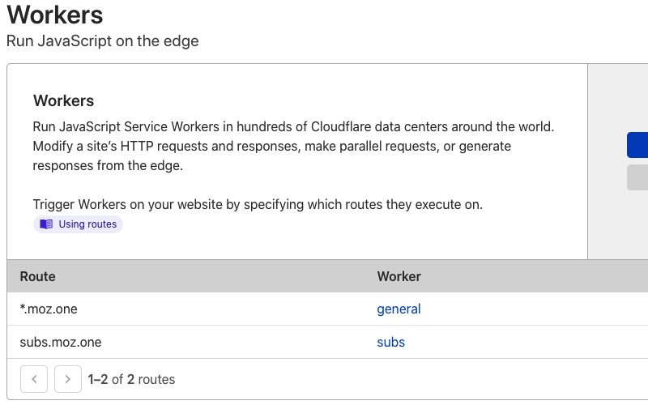
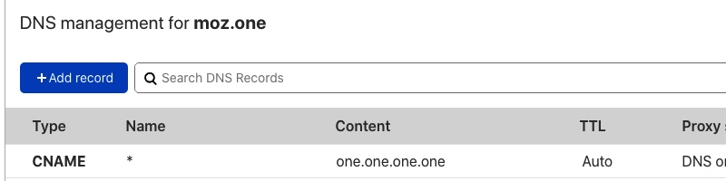

# subdomain-redirect

> Redirect service by access subdomain, powered by Cloudflare Workers and KV DB

## Notice

- Only 2nd level subdomains are supported. 
 > Because Cloudflare’s free SSL cert covered your domain and any 2nd level subdomain

## Deploy

1. create a worker



2. paste the code from ```index.js```



3. set KV database binding



4. create records in KV database



5. set route for ```*.example.com```



6. create DNS record for ```*.example.com``` 




## Reference

[Configuring SSL for multiple subdomains](https://community.cloudflare.com/t/configuring-ssl-for-multiple-subdomains/11771)

## Powered by

[Cloudflare Workers](https://workers.dev/)

## License

MIT
